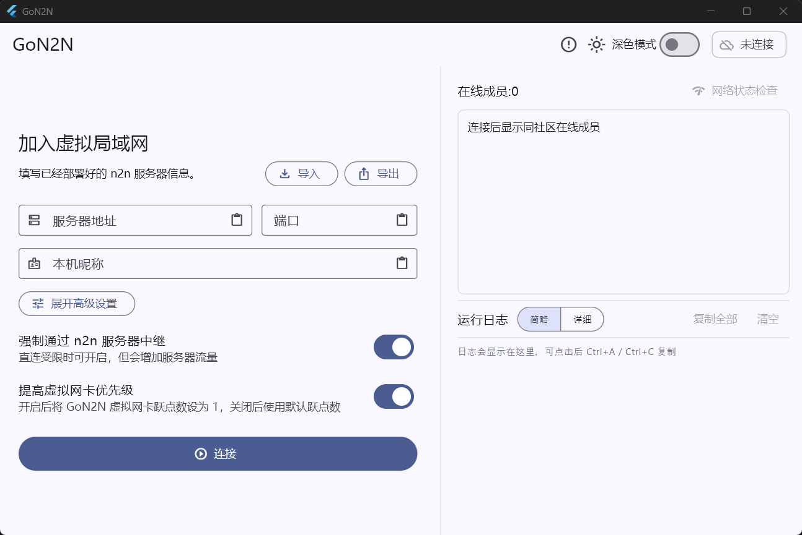
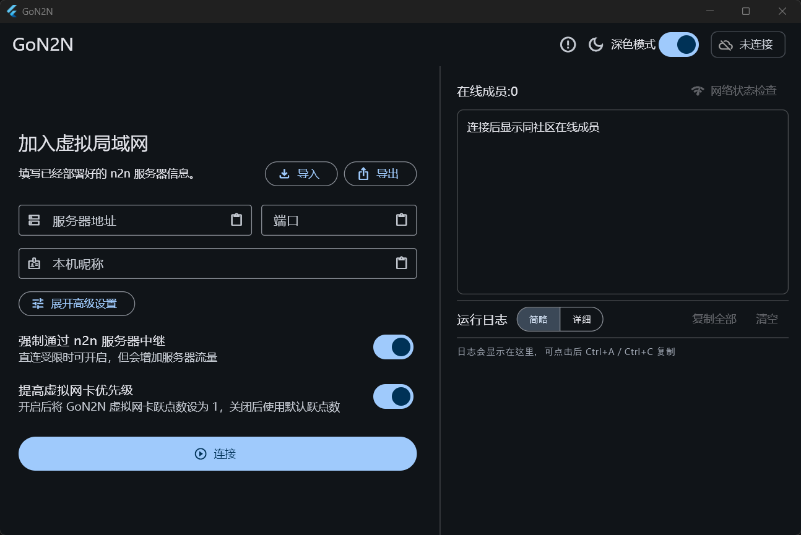

# GoN2N

GoN2N 是一个面向 Windows 客户端的 n2n 图形化工具。它通过 n2n `edge`
加入虚拟局域网，并提供在线成员列表、网络状态检查、TCP/UDP 连通性测试、
连接模式显示、自动重连、TAP 网卡检测与安装提示等功能。

GoN2N 本身不替代 n2n。实际的数据转发、加密、NAT 穿透和 supernode 中继仍由
n2n 完成；GoN2N 负责把连接配置、客户端体验和成员在线状态做得更容易使用。

当前版本：`v0.1.0`

| 浅色模式 | 深色模式 |
| --- | --- |
|  |  |

## 一、前期准备

你需要准备一台云服务器，用来运行：

- n2nR `也兼容[原版 n2n](https://github.com/ntop/n2n)，n2nR 比原版 n2n 增加了快速重连功能`
- member-server

建议在云服务器安全组、防火墙中放行：

| 端口 | 协议 | 用途 |
| --- | --- | --- |
| 51873 | TCP/UDP | n2nR |
| 51874 | TCP | GoN2N 在线成员服务 |


```bash
sudo ufw allow 51873/tcp
sudo ufw allow 51873/udp
sudo ufw allow 51874/tcp
```

如果没有使用 `ufw`，请按你的系统防火墙工具放行相同端口。

本文安装示例以 **Debian 13 64 位系统** 为例，对应下载：

```text
n2nR-server-v0.1.0-linux-amd64
gon2n-member-server-v0.1.0-linux-amd64
GoN2N-v0.1.0-windows-x64.zip
```

## 二、安装

### 2.1 服务器安装 n2nR

上传 `n2nR-server-v0.1.0-linux-amd64` 到服务器后，安装到 `/opt/gon2n/n2nR/n2nR`：

```bash
sudo mkdir -p /opt/gon2n/n2nR
sudo install -m 755 n2nR-server-v0.1.0-linux-amd64 /opt/gon2n/n2nR/n2nR
```

创建 systemd 服务：

```bash
sudo nano /etc/systemd/system/n2n-supernode.service
```

写入：

```ini
[Unit]
Description=n2n Supernode
After=network-online.target
Wants=network-online.target

[Service]
Type=simple
ExecStart=/opt/gon2n/n2nR/n2nR -p 51873 --gon2n-fast-reconnect -V v0.1.0
Restart=always
RestartSec=3

[Install]
WantedBy=multi-user.target
```

启动并设置开机自启：

```bash
sudo systemctl daemon-reload
sudo systemctl enable n2n-supernode
sudo systemctl start n2n-supernode
sudo systemctl status n2n-supernode --no-pager -l
```

确认端口监听：

```bash
sudo ss -lntup | grep 51873
```

### 2.2 服务器安装 member-server

`member-server` 用于维护 GoN2N 的在线成员列表。它不转发游戏流量，只处理客户端心跳、
成员列表和地址租约。

上传 `gon2n-member-server-v0.1.0-linux-amd64` 到服务器后，安装到
`/opt/gon2n/member-server/gon2n-member-server`：

```bash
sudo mkdir -p /opt/gon2n/member-server
sudo install -m 755 gon2n-member-server-v0.1.0-linux-amd64 /opt/gon2n/member-server/gon2n-member-server
```

创建 systemd 服务：

```bash
sudo nano /etc/systemd/system/gon2n-member-server.service
```

写入：

```ini
[Unit]
Description=GoN2N Member Server
After=network-online.target
Wants=network-online.target

[Service]
Type=simple
ExecStart=/opt/gon2n/member-server/gon2n-member-server member-server --listen :51874 --lease 30s
Restart=always
RestartSec=3

[Install]
WantedBy=multi-user.target
```

启动并设置开机自启：

```bash
sudo systemctl daemon-reload
sudo systemctl enable gon2n-member-server
sudo systemctl start gon2n-member-server
sudo systemctl status gon2n-member-server --no-pager -l
```

确认服务可用：

```bash
curl http://127.0.0.1:51874/healthz
```

正常会返回：

```text
ok
```

从本机电脑测试云服务器公网访问：

```powershell
curl.exe http://服务器公网IP:51874/healthz
```

### 2.3 客户端安装 GoN2N

在 Windows 客户端下载 `GoN2N-v0.1.0-windows-x64.zip`，解压后运行：

```text
GoN2N.exe
```

第一次运行可能会出现 Windows SmartScreen 提示，这是因为程序没有代码签名。如果确认来源可信，
可以点击“更多信息”，再选择“仍要运行”。

GoN2N 需要管理员权限，因为 n2n `edge.exe` 需要操作 TAP 网卡和虚拟网络配置。

客户端需要填写：

| 字段 | 说明 |
| --- | --- |
| 服务器地址 | 云服务器公网 IP 或域名 |
| 端口 | n2n supernode 端口，默认可使用 `51873` |
| 社区名 | 同一虚拟局域网内必须一致 |
| 本机昵称 | 显示在在线成员列表中的名称 |
| 成员服务地址 | 例如 `http://服务器公网IP:51874` |
| 成员服务密钥 | 与 member-server 使用的密钥一致 |
| 虚拟 IP | 本机在虚拟局域网中的 IP |
| 共享密钥 | 同一虚拟局域网内必须一致 |
| edge 程序路径 | 一般会自动识别发布包内的 `edge.exe` |

如果电脑没有 TAP-Windows 网卡，GoN2N 会提示安装。安装 TAP 驱动时同样需要管理员权限。

同一个虚拟局域网内：

- 服务器地址、端口、社区名、成员服务密钥、共享密钥必须一致
- 每台电脑的虚拟 IP 必须不同
- 虚拟 IP 建议使用同一个网段，例如 `10.239.180.x`

连接成功后，可以在右侧在线成员列表中查看同社区成员，并使用“网络状态检查”测试延迟、TCP、
UDP、丢包和连接模式。

## 三、更新

### 3.1 更新 n2nR

先停止服务：

```bash
sudo systemctl stop n2n-supernode
```

替换二进制文件：

```bash
sudo install -m 755 n2nR-server-v0.1.0-linux-amd64 /opt/gon2n/n2nR/n2nR
```

重新启动：

```bash
sudo systemctl start n2n-supernode
sudo systemctl status n2n-supernode --no-pager -l
```

查看日志：

```bash
sudo journalctl -u n2n-supernode -f
```

### 3.2 更新 member-server

先停止服务：

```bash
sudo systemctl stop gon2n-member-server
```

替换二进制文件：

```bash
sudo install -m 755 gon2n-member-server-v0.1.0-linux-amd64 /opt/gon2n/member-server/gon2n-member-server
```

重新启动：

```bash
sudo systemctl start gon2n-member-server
sudo systemctl status gon2n-member-server --no-pager -l
```

确认接口正常：

```bash
curl http://127.0.0.1:51874/healthz
```

查看日志：

```bash
sudo journalctl -u gon2n-member-server -f
```

### 3.3 更新 GoN2N

更新 Windows 客户端时：

1. 先在 GoN2N 中断开连接。
2. 退出 GoN2N。
3. 下载新的 Windows x64 发布包。
4. 解压到一个新的文件夹，或覆盖旧文件夹。
5. 重新运行 `GoN2N.exe`。

发布包内通常包含：

```text
GoN2N.exe
GoN2N_files/
```

请保持 `GoN2N.exe` 和 `GoN2N_files` 在同一个目录下，不要只单独复制 `GoN2N.exe`。

GoN2N 的本机配置保存在用户目录中，替换程序文件通常不会清空已经填写过的配置。

## 四、杂项

### 4.1 其他架构下载

本文安装示例使用 Debian 13 64 位。如果你的服务器不是 amd64，请在 Release 中选择对应架构：

```text
gon2n-member-server-v0.1.0-linux-386
gon2n-member-server-v0.1.0-linux-arm64
gon2n-member-server-v0.1.0-linux-armv7

n2nR-server-v0.1.0-linux-386
n2nR-server-v0.1.0-linux-arm64
n2nR-server-v0.1.0-linux-armv7
```

Windows 版服务端也会作为 Release 附件提供：

```text
gon2n-member-server-v0.1.0-windows-x64.exe
gon2n-member-server-v0.1.0-windows-x86.exe
n2nR-server-v0.1.0-windows-x64.exe
n2nR-server-v0.1.0-windows-x86.exe
```

### 4.2 编译 member-server 多平台产物

普通用户可以直接下载 Release 文件，不需要自己编译。

```bash
sh scripts/build-release.sh
```

输出位于 `dist/`：

```text
gon2n-member-server-windows-x64.exe
gon2n-member-server-windows-x86.exe
gon2n-member-server-linux-amd64
gon2n-member-server-linux-386
gon2n-member-server-linux-arm64
gon2n-member-server-linux-armv7
```

### 4.3 编译 n2nR 多平台产物

Linux 服务器需要安装交叉编译工具链。Debian/Ubuntu 可参考：

```bash
sudo apt update
sudo apt install -y build-essential git curl autoconf automake libtool pkg-config \
  gcc-i686-linux-gnu gcc-aarch64-linux-gnu gcc-arm-linux-gnueabihf mingw-w64
```

一次构建 Linux/Windows 多架构 n2nR：

```bash
TARGET=all ./scripts/build-n2nr-linux-amd64.sh
```

也可以单独构建某个目标：

```bash
TARGET=linux-amd64 ./scripts/build-n2nr-linux-amd64.sh
TARGET=linux-386 ./scripts/build-n2nr-linux-amd64.sh
TARGET=linux-arm64 ./scripts/build-n2nr-linux-amd64.sh
TARGET=linux-armv7 ./scripts/build-n2nr-linux-amd64.sh
TARGET=windows-amd64 ./scripts/build-n2nr-linux-amd64.sh
TARGET=windows-386 ./scripts/build-n2nr-linux-amd64.sh
```

### 4.4 编译 Windows GUI

Windows GUI 必须在 Windows 电脑上构建，需要 Flutter 和 Visual Studio Desktop development with C++。

```powershell
cd desktop_gui
flutter build windows --release
```

结果位于：

```text
desktop_gui\build\windows\x64\runner\Release\
```

分发时必须复制整个 `Release` 文件夹，不能只复制其中的 `.exe`。

### 4.5 安全提示

- 不要公开分享共享密钥。
- 不要把包含真实服务器地址和共享密钥的导出配置发布到公开仓库。
- 如果多人共用同一个虚拟局域网，建议使用足够长的随机共享密钥。
- 如果怀疑共享密钥泄露，请同时修改所有客户端配置。

### 4.6 第三方组件

GoN2N 使用 n2n 作为虚拟局域网数据层。第三方组件说明见
[`THIRD_PARTY_NOTICES.md`](THIRD_PARTY_NOTICES.md)。
