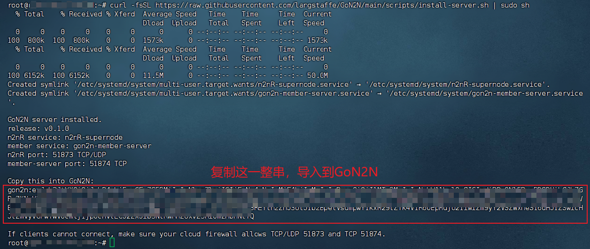
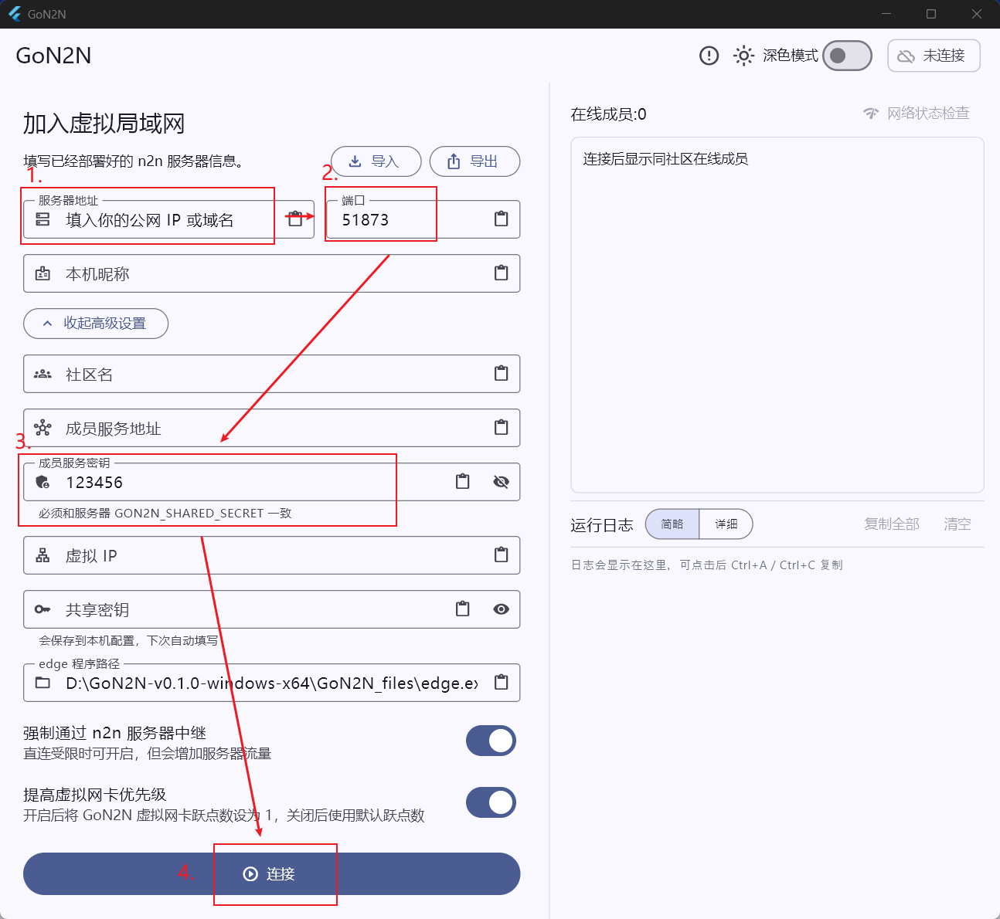

# GoN2N

GoN2N 是一个面向 Windows 客户端的 n2n 图形化工具。它通过 n2n `edge`
加入虚拟局域网，并提供在线成员列表、网络状态检查、TCP/UDP 连通性测试、
连接模式显示、自动重连、TAP 网卡检测与安装提示等功能。

GoN2N 本身不替代 n2n。实际的数据转发、加密、NAT 穿透和 supernode 中继仍由
n2n 完成；GoN2N 负责把连接配置、客户端体验和成员在线状态做得更容易使用。

当前版本：`v0.1.0`

| 浅色模式 | 深色模式 |
| --- | --- |
|  |  |

## 目录

- [一、前期准备](#一前期准备)
- [二、安装](#二安装)
  - [2.1 服务器安装 n2nR 和 member-server](#21-服务器安装-n2nr-和-member-server)
    - [2.1.1 自动安装](#211-自动安装)
    - [2.1.2 手动安装](#212-手动安装)
      - [（1）服务器安装 n2nR](#1服务器安装-n2nr)
      - [（2）服务器安装 member-server](#2服务器安装-member-server)
  - [2.2 客户端安装 GoN2N](#22-客户端安装-gon2n)
- [三、更新](#三更新)
  - [3.1 更新 n2nR](#31-更新-n2nr)
  - [3.2 更新 member-server](#32-更新-member-server)
  - [3.3 更新 GoN2N](#33-更新-gon2n)
- [四、其他](#四其他)
  - [4.1 安全提示](#41-安全提示)
  - [4.2 第三方组件](#42-第三方组件)
  - [4.3 License](#43-license)

## 一、前期准备

你需要准备一台云服务器，用来运行：

- n2nR （也兼容[原版 n2n](https://github.com/ntop/n2n)，n2nR 比原版 n2n 增加了快速重连功能）
- member-server

建议在云服务器安全组、防火墙中放行：

| 端口 | 协议 | 用途 |
| --- | --- | --- |
| 51873 | TCP/UDP | n2nR |
| 51874 | TCP | GoN2N 在线成员服务 |


## 二、安装

本文安装示例以 **Debian 13 64 位系统** 为例，对应下载：

```text
n2nR-server-v0.1.0-linux-amd64
gon2n-member-server-v0.1.0-linux-amd64
GoN2N-v0.1.0-windows-x64.zip
```

### 2.1 服务器安装 n2nR 和 member-server

#### 2.1.1 自动安装

在服务器上执行：

```bash
curl -fsSL https://raw.githubusercontent.com/langstaffe/GoN2N/main/scripts/install-server.sh | sudo sh
```

如果系统提示没有 `curl`，Debian / Ubuntu 可以先执行：

```bash
sudo apt update
sudo apt install -y curl
```

脚本会自动创建安装目录、下载最新 release 中适合当前 Linux 架构的 `n2nR-server` 和
`gon2n-member-server`、生成复杂的成员服务密钥、创建 systemd 服务并启动。

安装完成后，脚本会输出一串 `gon2n:...` 连接信息。复制这串内容到 GoN2N 客户端，点击
“导入”即可自动填入服务器地址、端口、社区名、成员服务地址、共享密钥和成员服务密钥。



如果服务器无法自动识别公网 IP，可以手动指定：

```bash
curl -fsSL https://raw.githubusercontent.com/langstaffe/GoN2N/main/scripts/install-server.sh | sudo env PUBLIC_HOST=你的服务器公网IP sh
```

如果需要固定安装某个版本：

```bash
curl -fsSL https://raw.githubusercontent.com/langstaffe/GoN2N/main/scripts/install-server.sh | sudo env VERSION=v0.1.0 sh
```

#### 2.1.2 手动安装

##### （1）服务器安装 n2nR

上传 `n2nR-server-v0.1.0-linux-amd64` 到服务器后，安装到 `/opt/gon2n/n2nR/n2nR-server-linux-amd64`：

```bash
sudo mkdir -p /opt/gon2n/n2nR
cd /opt/gon2n/n2nR
# 将 n2nR-server-v0.1.0-linux-amd64 上传到这个文件夹
sudo install -m 755 n2nR-server-v0.1.0-linux-amd64 /opt/gon2n/n2nR/n2nR-server-linux-amd64
```

创建 systemd 服务：

```bash
sudo nano /etc/systemd/system/n2nR-supernode.service
```

写入：

```ini
[Unit]
Description=n2nR Supernode
After=network-online.target
Wants=network-online.target

[Service]
Type=simple
ExecStart=/opt/gon2n/n2nR/n2nR-server-linux-amd64 -f -p 51873 --gon2n-fast-reconnect
Restart=always
RestartSec=3

[Install]
WantedBy=multi-user.target
```
按 `Ctrl+X`，再按 `Y` 和 `Enter` 保存并退出。

启动并设置开机自启：

```bash
sudo systemctl daemon-reload
sudo systemctl enable n2nR-supernode
sudo systemctl start n2nR-supernode
sudo systemctl status n2nR-supernode --no-pager -l
```

确认端口监听：

```bash
sudo ss -lntup | grep 51873
```

##### （2）服务器安装 member-server

`member-server` 用于维护 GoN2N 的在线成员列表。它不转发游戏流量，只处理客户端心跳、
成员列表和地址租约。

上传 `gon2n-member-server-v0.1.0-linux-amd64` 到服务器后，安装到
`/opt/gon2n/member-server/gon2n-member-server`：

```bash
sudo mkdir -p /opt/gon2n/member-server
cd /opt/gon2n/member-server
# 将 gon2n-member-server-v0.1.0-linux-amd64 上传到这个文件夹
sudo install -m 755 gon2n-member-server-v0.1.0-linux-amd64 /opt/gon2n/member-server/gon2n-member-server
```

创建 systemd 服务：

```bash
sudo nano /etc/systemd/system/gon2n-member-server.service
```

写入：

```ini
[Unit]
Description=GoN2N Member Server
After=network-online.target
Wants=network-online.target

[Service]
Type=simple
# 在这里设置成员服务密钥，待会要填到 GoN2N 客户端里，不要用下面的123456，推荐设置复杂一些
Environment="GON2N_SHARED_SECRET=123456"
ExecStart=/opt/gon2n/member-server/gon2n-member-server member-server --listen :51874 --lease 30s
Restart=always
RestartSec=3

[Install]
WantedBy=multi-user.target
```
按 `Ctrl+X`，再按 `Y` 和 `Enter` 保存并退出。

启动并设置开机自启：

```bash
sudo systemctl daemon-reload
sudo systemctl enable gon2n-member-server
sudo systemctl start gon2n-member-server
sudo systemctl status gon2n-member-server --no-pager -l
```

确认服务可用：

```bash
curl http://127.0.0.1:51874/healthz
```

正常会返回：

```text
ok
```

从本机电脑测试云服务器公网访问：

```powershell
curl.exe http://服务器公网IP:51874/healthz
```

### 2.2 客户端安装 GoN2N

在 Windows 客户端下载 [`GoN2N-v0.1.0-windows-x64.zip`](https://github.com/langstaffe/GoN2N/releases/download/v0.1.0/GoN2N-v0.1.0-windows-x64.zip)，解压后运行：

```text
GoN2N.exe
```

第一次运行可能会出现 Windows SmartScreen 提示，这是因为程序没有代码签名。如果确认来源可信，
可以点击“更多信息”，再选择“仍要运行”。

GoN2N 需要管理员权限，因为 n2n `edge.exe` 需要操作 TAP 网卡和虚拟网络配置。

如果电脑没有 TAP-Windows 网卡，GoN2N 会提示安装。安装 TAP 驱动时同样需要管理员权限。

第一次使用客户端，只需要填写：

| 字段 | 说明 |
| --- | --- |
| 服务器地址 | 云服务器公网 IP 或域名 |
| 端口 | n2nR supernode 端口，默认可使用 `51873` |
| 成员服务密钥 | 参考 2.1.2 手动安装 member-server 时设置的 `GON2N_SHARED_SECRET` |



再点击下方的`连接`。

社区名、成员服务地址、虚拟 IP、共享密钥等信息会在点击连接时自动补全；如果你导入别人分享的节点信息，也会自动填入这些配置。

连接成功后，可以在右侧在线成员列表中查看同社区成员，并使用“网络状态检查”测试延迟、TCP、
UDP、丢包和连接模式。

可通过导出、导入按钮快速分享节点信息给别人。

## 三、更新

### 3.1 更新 n2nR

先停止服务：

```bash
sudo systemctl stop n2nR-supernode
```

替换二进制文件：

```bash
sudo install -m 755 n2nR-server-v0.1.0-linux-amd64 /opt/gon2n/n2nR/n2nR-server-linux-amd64
```

重新启动：

```bash
sudo systemctl start n2nR-supernode
sudo systemctl status n2nR-supernode --no-pager -l
```

查看日志：

```bash
sudo journalctl -u n2nR-supernode -f
```

### 3.2 更新 member-server

先停止服务：

```bash
sudo systemctl stop gon2n-member-server
```

替换二进制文件：

```bash
sudo install -m 755 gon2n-member-server-v0.1.0-linux-amd64 /opt/gon2n/member-server/gon2n-member-server
```

重新启动：

```bash
sudo systemctl start gon2n-member-server
sudo systemctl status gon2n-member-server --no-pager -l
```

确认接口正常：

```bash
curl http://127.0.0.1:51874/healthz
```

查看日志：

```bash
sudo journalctl -u gon2n-member-server -f
```

### 3.3 更新 GoN2N

更新 Windows 客户端时：

1. 先在 GoN2N 中断开连接。
2. 退出 GoN2N。
3. 下载新的 Windows x64 发布包。
4. 解压到一个新的文件夹，或覆盖旧文件夹。
5. 重新运行 `GoN2N.exe`。

发布包内通常包含：

```text
GoN2N.exe
GoN2N_files/
```

请保持 `GoN2N.exe` 和 `GoN2N_files` 在同一个目录下，不要只单独复制 `GoN2N.exe`。

GoN2N 的本机配置保存在用户目录中，替换程序文件通常不会清空已经填写过的配置。

## 四、其他

### 4.1 安全提示

- 不要公开分享共享密钥。
- 不要把包含真实服务器地址和共享密钥的导出配置发布到公开仓库。
- 如果多人共用同一个虚拟局域网，建议使用足够长的随机共享密钥。
- 如果怀疑共享密钥泄露，请同时修改所有客户端配置。

### 4.2 第三方组件

GoN2N 使用 n2n 作为虚拟局域网数据层。第三方组件说明见
[`THIRD_PARTY_NOTICES.md`](THIRD_PARTY_NOTICES.md)。

### 4.3 License

GoN2N 使用 GNU General Public License v3.0 开源。详情见 [`LICENSE`](LICENSE)。
